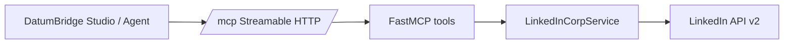

# Architecture — LinkedIn Corp MCP

## Overview

`linkedin-corp-mcp` is a FastMCP HTTP tool-server for LinkedIn **organization**
(Company Page) social APIs. It is intentionally separate from `linkedin-mcp`
(personal member account).

## Components

| Component | Role |
|-----------|------|
| `app/mcp_server.py` | FastMCP tool definitions + Starlette routes |
| `app/services/linkedin_corp_service.py` | LinkedIn REST client (org ACLs, ugcPosts) |
| `app/oauth_routes.py` | Optional local OAuth connect (org scopes) |
| `static/test-ui.html` | Manual MCP tools/call UI |

## Data flow

## Security boundaries

- Credentials passed per tool call; no server-side token vault in v1
- `organization_urn` validated against administered org list
- Create/delete gated by `confirm=true`
- OAuth UI disabled by default in production images

## Deployment

- Docker image: `linkedin-corp-mcp:local` (or registry tag)
- Kubernetes: `linkedin-corp-mcp-main` in `mcp-tools` namespace
- Health: `GET /health`

## Related

- Personal account server: `../linkedin-mcp/`
- ADR: [`../adr/ADR-0001-split-from-linkedin-mcp.md`](../adr/ADR-0001-split-from-linkedin-mcp.md)
